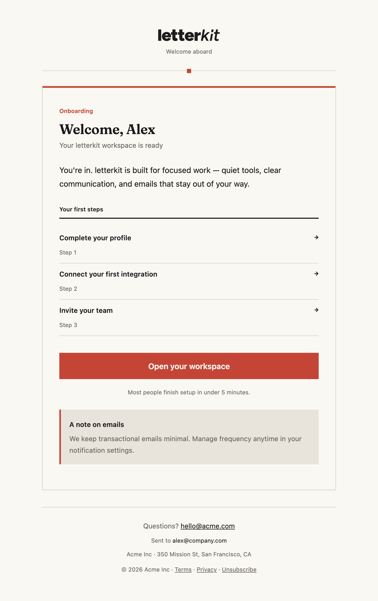
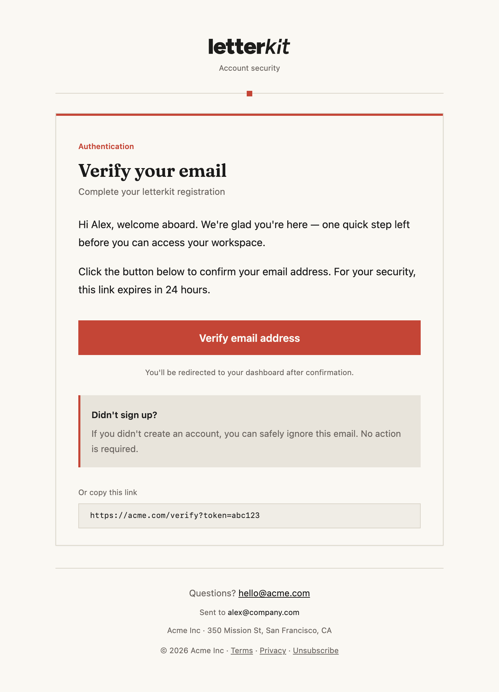
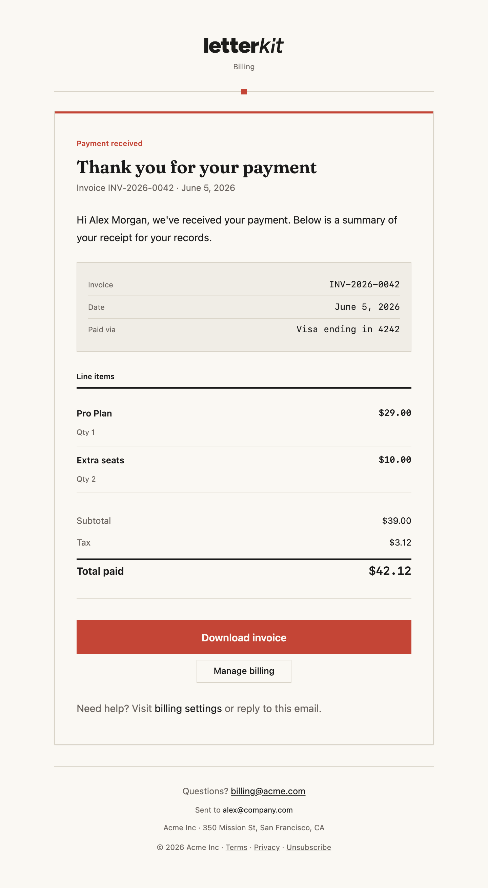

<p align="center">
  
</p>

# letterkit

**Copy-paste transactional email themes for React Email.**

letterkit ships curated theme collections — not loose components — so the emails your app sends share one design system. Run `npx @letterkit/cli@latest theme add`, own the source, customize freely.

[](https://www.npmjs.com/package/@letterkit/cli)
[](./LICENSE)
[](https://github.com/sefazor/letterkit)
[](https://letterkit.dev)

## ✨ Features

- **Complete themes** — 378 templates across 4 design systems
- **Copy, don't install** — templates live in your repo, fully editable
- **React Email** — modern DX with email-client-safe styling
- **Registry-driven CLI** — install a full theme or individual templates
- **Shared components** — consistent layout, header, footer per theme
- **Auto peer deps** — CLI installs `@react-email/components` and other deps for you

## 🚀 Quickstart

```bash
npx @letterkit/cli@latest init
npx @letterkit/cli@latest theme add grundy
```

After the first install, use the local binary:

```bash
letterkit list
letterkit theme add beacon
letterkit add auth/verify-email
```

Browse and preview every template at [letterkit.dev/themes](https://letterkit.dev/themes).

## 🎨 Themes

| Theme   | Templates | Tier | Description |
| ------- | --------- | ---- | ----------- |
| Grundy  | 52        | free | Quiet, confident, modern. Cream & terracotta. |
| Beacon  | 52        | free | Fintech feel. Forest signature, mono numerals, billing layouts. |
| Foundry | 137       | free | Dark-first brutalist editorial. Dev tools & changelogs. |
| Sensei  | 137       | free | Full SaaS suite — auth, billing, onboarding, integrations, and more. |

<p align="center">
  
  &nbsp;&nbsp;
  
</p>

### Template coverage

Themes include templates across auth, billing, onboarding, transactional, notification, team, lifecycle, and product categories. [Browse the full catalog →](https://letterkit.dev/themes)

## 📦 CLI

```bash
# Discover
letterkit list                          # list themes
letterkit list --theme grundy           # list templates in a theme

# Install
letterkit theme add grundy              # install all templates in a theme
letterkit add auth/verify-email         # single template (uses defaultTheme)
letterkit add grundy/auth/verify-email  # explicit theme path
```

`theme add` and `add` detect your package manager (pnpm, npm, yarn, bun) and install template dependencies automatically.

## 🤝 Contributing

See [CONTRIBUTING.md](./CONTRIBUTING.md) for dev setup, theme authoring, and PR guidelines.

## 📄 License

MIT © [letterkit contributors](./LICENSE)
